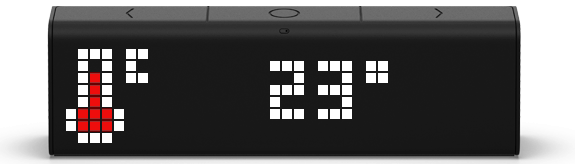
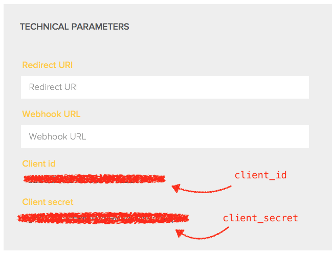
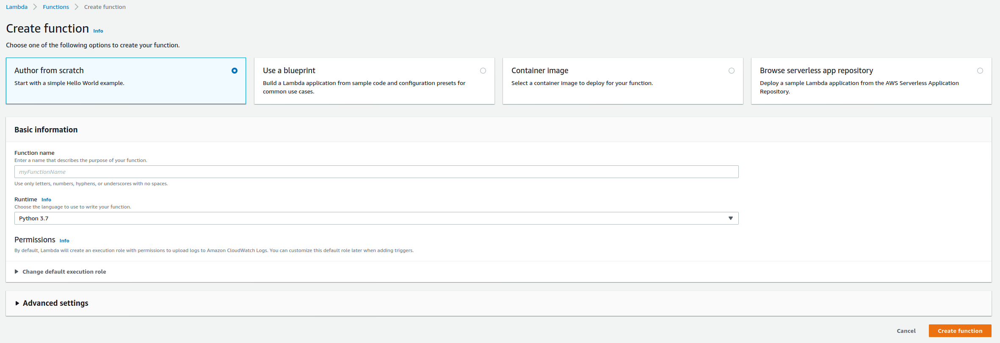
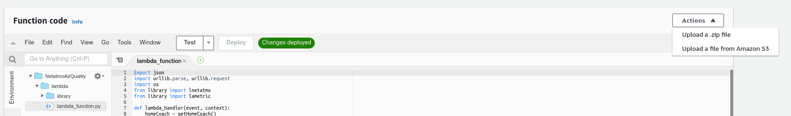
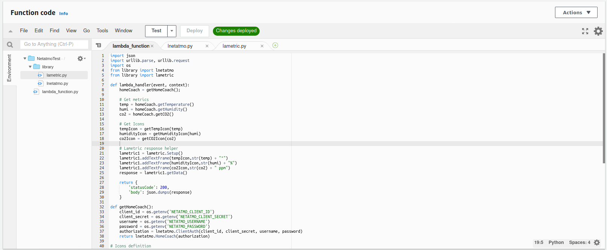
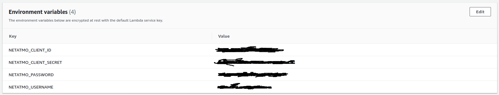
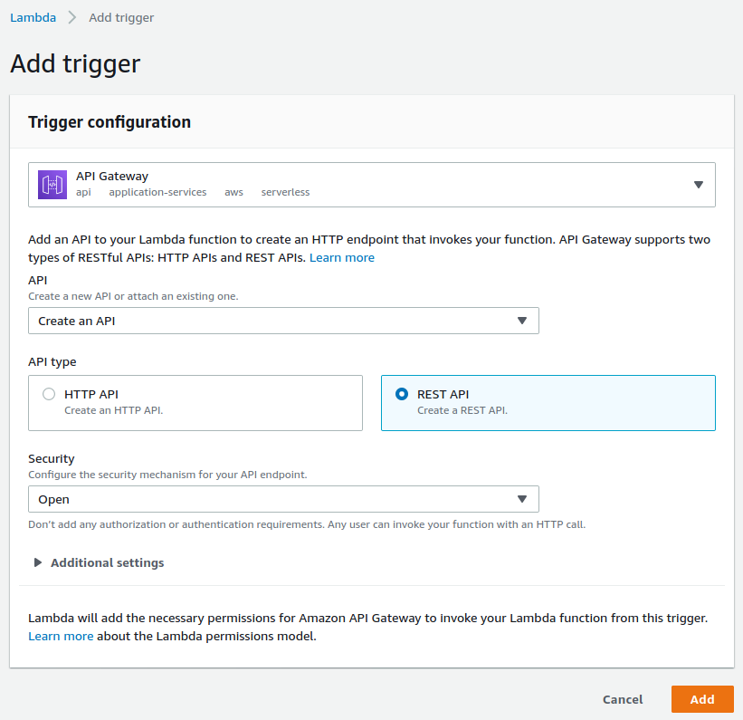
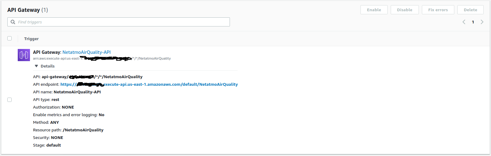
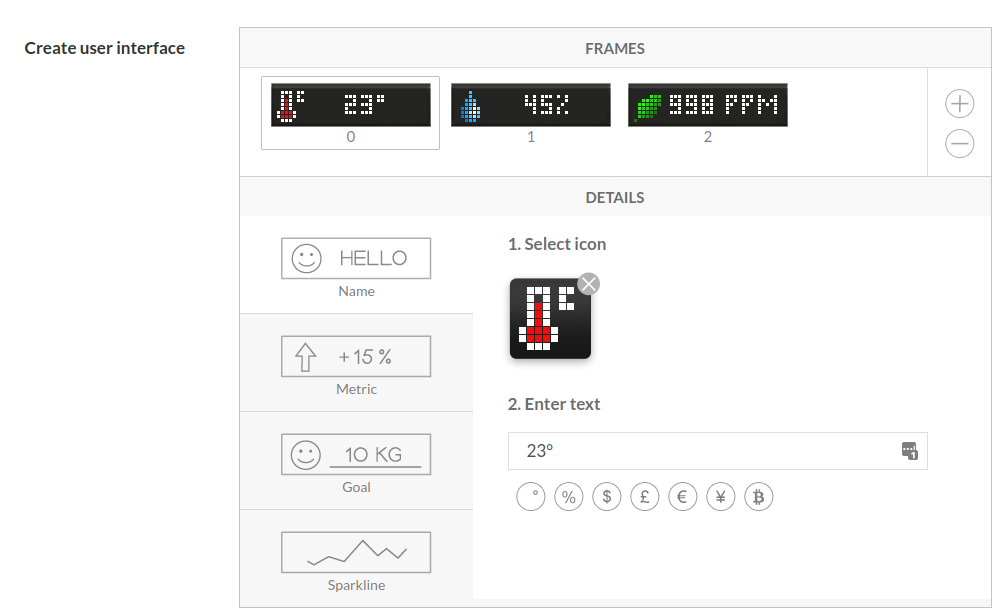
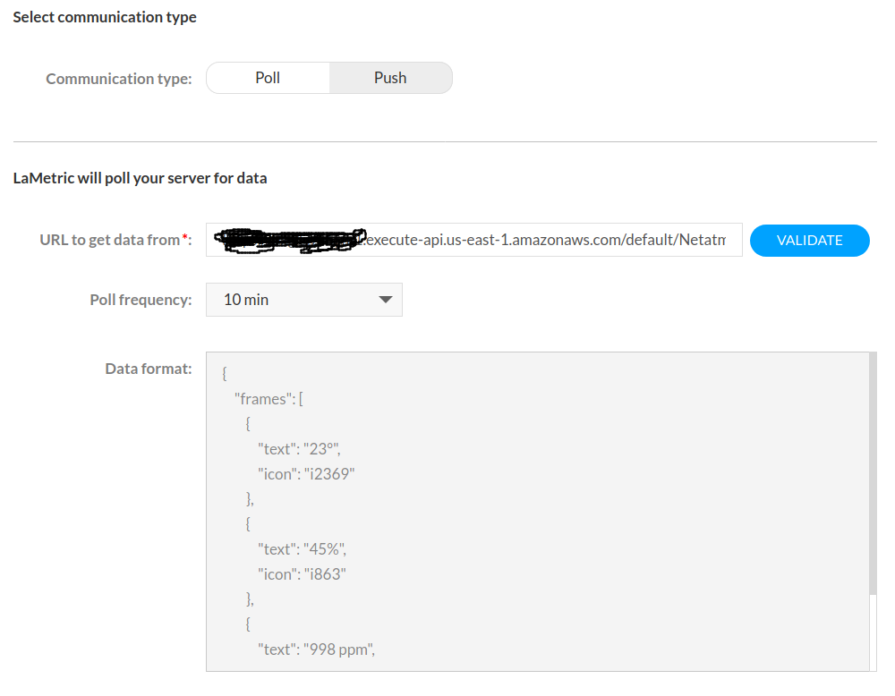

# LaMetric app for Netatmo Indoor Air Quality Monitor

A simple client which turns LaMetric into Netamo display. This client polls [Netatmo API](https://github.com/philippelt/netatmo-api-python) and shows the weather data on LaMetric display. This project is highly inspired by this [LaMetric app for Netatmo Weather Station](https://github.com/baracudaz/netatmo-lametric-proxy/)

## Netatmo Setup

Go to the [Netatmo Developer Site](https://dev.netatmo.com) again signin with your credentials (or signup for an account if you haven't done so already).

Create a Netatmo app. Leave both Redirect URI and Webhook URI empty. 

Now make a note of `client_id` and `client_secret`. The `username` which is your emaill and `password` are your Netatmo login credentials. All of these will be needed to configure the AWS lambda that will retrieve the data. Make sure to enable the app.

## AWS Lambda Setup

Signup for an [AWS Account](https://aws.amazon.com/console/). At the time of writing this the free account should offer more than enough resources to setup this simple lambda and the AWS Gateway offers plenty of calls on the free 12 months trial.

Create a lambda function with the latest version of Python.

Update the *Function Code* with the scripts from the lambda file (you can zip the folder and upload it directly)

Create the NETATMO_CLIENT_ID, NETATMO_CLIENT_SECRET, NETATMO_PASSWORD, NETATMO_USERNAME environment variables (the values are the ones from the Netatmo setup)

Add AWS Gateway as a trigger for the lamdba(Note the open security - thus means anyone with the link can access this API and your data)

Make a note of the *API endpoint* as it will be needed during the LaMetric Setup

## LaMetric Setup

Go to the [LaMetric Developper site](https://developer.lametric.com) signin with your credentials (or signup for an account if you haven't done so already). Now create your new private app with with the following six frames:

1. frame **Name** for temperature value
1. frame **Name** for humidity value
1. frame **Name** for co2 value

*Note:* The text and icon on the each frame are optional. They will be overriden by the script anyway.

Make sure to set the *Application type* to *Poll* and put in the URL from the AWS gateway in *URL to get data from* and set the *Poll frequency* to 10 min. Publish your app as a private app.

Install the App on you LaMetric Time

Enjoy!